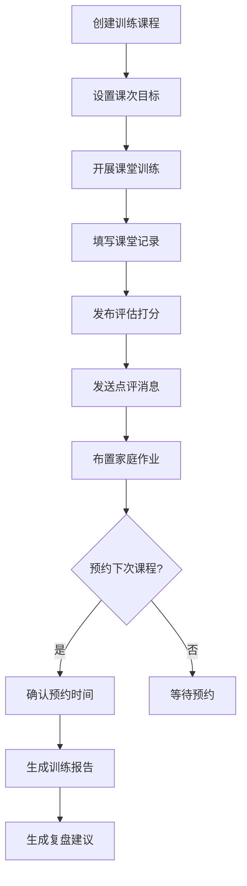
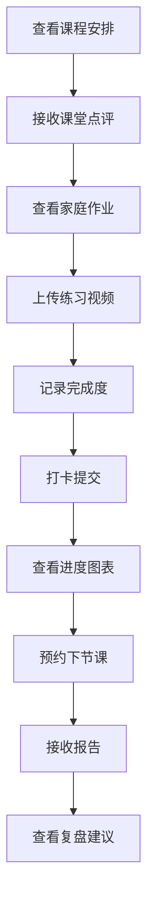

# 宠物训练记录小程序 - 产品需求文档

## 1. 产品概述

**PetTrainerPro** 是一款面向宠物训练师与宠物主人共同使用的训练记录小程序，通过数字化方式追踪宠物训练进度，提升训练效率与效果。

- **核心目的**：建立训练师与主人之间的协作桥梁，实现训练课程的系统化管理与实时跟进
- **目标用户**：宠物训练师、宠物主人（犬类为主）
- **市场价值**：填补宠物训练行业缺乏专业数字化工具的空白，提供从课程创建到效果评估的完整解决方案

## 2. 核心功能

### 2.1 用户角色

| 角色 | 注册方式 | 核心权限 |
|------|----------|----------|
| 宠物主人 | 手机号/微信授权 | 创建宠物档案、记录打卡、查看进度、接收点评 |
| 训练师 | 手机号认证 | 创建课程、记录课堂表现、发布评估、发送消息 |

### 2.2 功能模块

1. **课程页** - 训练师创建和管理训练课程项目
2. **课堂记录页** - 训练师记录每次课程的表现详情
3. **打卡页** - 主人上传练习视频并记录完成度
4. **评估页** - 训练师按多维度打分评估
5. **消息页** - 实时接收训练师点评和系统通知
6. **进度页** - 图表展示各项目的提升趋势
7. **档案页** - 保存宠物性格、禁忌和既往问题
8. **预约与报告** - 预约下节课、导出报告、生成复盘建议

## 3. 核心页面详情

### 3.1 课程页（Course Page）

**模块组成**：
- 课程项目列表（基础服从、社交脱敏、笼内训练等）
- 每个项目的课次目标设置
- 课程进度追踪
- 新建课程入口

**功能细节**：
- 训练师可创建多个训练项目
- 每个项目设置具体的课次目标（如：完成5次坐指令、达到80%成功率）
- 显示当前课程进度（已完成/总课次）
- 支持编辑和删除课程项目

### 3.2 课堂记录页（Training Record Page）

**模块组成**：
- 课程基本信息（宠物名称、训练师、日期）
- 动作表现记录表
- 奖励方式记录
- 问题行为记录
- 家庭作业布置

**功能细节**：
- 训练师填写宠物的动作完成度（优秀/良好/一般/需改进）
- 记录使用的奖励方式（零食/口头表扬/玩具）
- 标注课堂中出现的问题行为
- 布置家庭作业并设置完成期限
- 支持语音转文字快速记录

### 3.3 主人打卡页（Check-in Page）

**模块组成**：
- 今日作业展示
- 视频上传区域
- 完成度滑块
- 打卡日历
- 打卡历史

**功能细节**：
- 主人查看当日家庭作业
- 上传练习视频（支持本地上传）
- 滑动选择完成度（0-100%）
- 日历视图展示打卡记录
- 训练师可查看主人打卡情况

### 3.4 评估页（Evaluation Page）

**模块组成**：
- 多维度评分卡
- 雷达图可视化
- 评估历史对比
- 综合建议

**功能细节**：
- 评估维度：反应速度、稳定性、专注度、服从性、抗干扰能力
- 五星评分制 + 具体分数（0-100）
- 雷达图直观展示各维度表现
- 与历史评估对比展示进步
- 生成综合改进建议

### 3.5 消息页（Message Page）

**模块组成**：
- 消息列表（按时间排序）
- 消息详情
- 训练师点评卡片
- 系统通知

**功能细节**：
- 接收训练师的点评和反馈
- 课程预约确认通知
- 打卡提醒
- 进度达成通知
- 支持图片和文字消息

### 3.6 进度页（Progress Page）

**模块组成**：
- 总进度概览
- 项目进度图表
- 趋势折线图
- 成就徽章

**功能细节**：
- 折线图展示各维度评分变化趋势
- 柱状图对比各项目完成度
- 进度百分比环形图
- 达成里程碑展示（首次成功、连续打卡等）
- 支持时间段筛选（本周/本月/全部）

### 3.7 档案页（Profile Page）

**模块组成**：
- 宠物基本信息
- 性格特征标签
- 禁忌事项
- 既往问题记录
- 健康状况备注

**功能细节**：
- 宠物照片、名称、品种、年龄、体重
- 性格标签（活泼/安静/胆小/固执等）
- 禁忌事项（如：对某些声音敏感、不能吃某些食物）
- 记录曾经的问题行为及改善情况
- 过敏史、疾病史等健康备注

### 3.8 预约与报告功能

**模块组成**：
- 课程预约日历
- 训练报告导出
- 阶段复盘建议

**功能细节**：
- 主人可预约下次课程时间
- 训练师确认或调整预约
- 一键生成训练报告（PDF/图片）
- 报告包含：课程总结、评分变化、问题分析、改进建议
- 阶段性复盘自动生成（每月/每10节课）

## 4. 核心流程

### 4.1 训练师端主流程



### 4.2 主人端主流程



## 5. 用户界面设计

### 5.1 设计风格

**主题定位**：温暖专业、友好可信赖

**色彩方案**：
- 主色调：温暖的橙色 `#FF8C42`（代表活力与温暖）
- 辅助色：柔和的绿色 `#52B788`（代表成长与健康）
- 强调色：明亮的蓝色 `#4D96FF`（用于重要操作和通知）
- 背景色：温暖的米白 `#FFF8F0`
- 文字色：深灰 `#2D3436`、中灰 `#636E72`

**字体选择**：
- 标题字体：思源黑体（Noto Sans SC Bold）
- 正文字体：思源黑体（Noto Sans SC Regular）
- 数字字体：DIN Alternate（用于评分和进度展示）

**布局风格**：
- 底部导航栏（5个主要入口）
- 卡片式内容布局
- 圆润的按钮和输入框
- 友好的图标风格（线性图标 + 适度色彩）

### 5.2 页面设计总览

| 页面名称 | 主要模块 | 布局风格 |
|----------|----------|----------|
| 课程页 | 项目卡片、进度条、目标列表 | 列表式布局 + 悬浮操作按钮 |
| 课堂记录 | 表单卡片、评分组件、作业区 | 垂直滚动表单 |
| 打卡页 | 日历视图、视频上传、完成度滑块 | 上下分区布局 |
| 评估页 | 评分卡、雷达图、建议区 | 数据可视化主导 |
| 消息页 | 消息列表、详情卡片 | 标准消息列表 |
| 进度页 | 图表区域、筛选器、徽章墙 | 仪表盘风格 |
| 档案页 | 信息表单、标签组件 | 分组表单布局 |

### 5.3 响应式设计

- 移动端优先设计
- 触摸友好的大按钮（最小48px）
- 适配主流手机屏幕尺寸（320px-428px宽度）
- 底部固定导航栏确保单手操作

### 5.4 交互动效

- 页面切换：平滑淡入淡出（300ms）
- 卡片加载：依次浮入动画
- 评分交互：星星点亮反馈
- 打卡成功：庆祝动画（撒花效果）
- 进度更新：环形图动态填充

## 6. 数据模型

### 6.1 核心实体

```mermaid
erDiagram
    Pet ||--o{ Course : has
    Pet ||--o{ TrainingRecord : has
    Pet ||--o{ CheckIn : has
    Pet ||--o{ Evaluation : has
    Pet ||--o{ Profile : has
    Trainer ||--o{ Course : creates
    Trainer ||--o{ TrainingRecord : writes
    Trainer ||--o{ Evaluation : makes
    Course ||--o{ TrainingRecord : contains
    Course ||--o{ Evaluation : includes
    Course ||--{ LessonTarget : has

    Pet {
        string id PK
        string name
        string breed
        int age
        string avatar
        string temperament
        array allergies
        string禁忌
    }
    
    Course {
        string id PK
        string pet_id FK
        string trainer_id FK
        string name
        string category
        int total_lessons
        int completed_lessons
        array lesson_targets
        date created_at
    }
    
    TrainingRecord {
        string id PK
        string course_id FK
        string trainer_id FK
        date record_date
        object action_performance
        string reward_method
        array problem_behaviors
        string homework
        date homework_due
    }
    
    CheckIn {
        string id PK
        string pet_id FK
        string record_id FK
        string video_url
        int completion_rate
        string notes
        date check_in_date
    }
    
    Evaluation {
        string id PK
        string pet_id FK
        string course_id FK
        int reaction_speed
        int stability
        int focus
        int obedience
        int anti_interference
        string comment
        date evaluated_at
    }
```

### 6.2 页面优先级

**第一阶段（核心MVP）**：
1. 档案页 - 建立宠物基础信息
2. 课程页 - 创建和管理训练项目
3. 课堂记录页 - 记录训练详情
4. 打卡页 - 主人日常打卡

**第二阶段（功能完善）**：
5. 评估页 - 多维度评分
6. 进度页 - 数据可视化
7. 消息页 - 即时通讯

**第三阶段（高级功能）**：
8. 预约系统
9. 报告导出
10. 智能复盘
