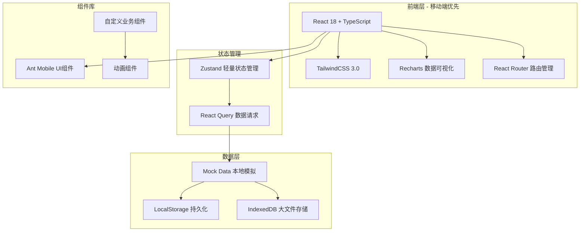

# 宠物训练记录小程序 - 技术架构文档

## 1. 架构设计



## 2. 技术选型说明

### 2.1 前端技术栈

| 技术 | 版本 | 用途说明 |
|------|------|----------|
| React | 18.x | 核心框架，组件化开发 |
| TypeScript | 5.x | 类型安全，提升代码质量 |
| Vite | 5.x | 快速构建工具 |
| TailwindCSS | 3.x | 原子化CSS，快速样式开发 |
| React Router | 6.x | 单页应用路由管理 |
| Zustand | 4.x | 轻量级状态管理 |
| React Query | 5.x | 数据请求与缓存 |
| Recharts | 2.x | 数据可视化图表库 |
| Ant Design Mobile | 5.x | 移动端UI组件库 |

### 2.2 数据存储策略

- **LocalStorage**：用户偏好设置、登录状态
- **IndexedDB**：视频文件等大文件本地缓存
- **Mock Data**：模拟后端API响应数据

## 3. 路由定义

| 路由路径 | 页面名称 | 访问权限 | 功能描述 |
|----------|----------|----------|----------|
| `/` | 首页/课程页 | 全部用户 | 展示训练课程列表 |
| `/course/:id` | 课程详情页 | 全部用户 | 查看课程详情和进度 |
| `/record/:courseId` | 课堂记录页 | 训练师 | 填写训练记录 |
| `/checkin` | 打卡页 | 主人 | 日常打卡上传 |
| `/evaluation/:petId` | 评估页 | 训练师 | 评分和评估 |
| `/messages` | 消息页 | 全部用户 | 消息列表和详情 |
| `/progress/:petId` | 进度页 | 全部用户 | 数据图表展示 |
| `/profile/:petId` | 档案页 | 全部用户 | 宠物档案信息 |
| `/booking` | 预约页 | 主人 | 预约下次课程 |
| `/report/:courseId` | 报告页 | 全部用户 | 训练报告导出 |

## 4. 组件架构

### 4.1 页面组件结构

```
src/
├── pages/
│   ├── CoursePage/           # 课程页
│   │   ├── CourseCard.tsx
│   │   ├── CourseList.tsx
│   │   └── CreateCourseModal.tsx
│   ├── RecordPage/           # 课堂记录页
│   │   ├── RecordForm.tsx
│   │   ├── PerformanceItem.tsx
│   │   └── HomeworkSection.tsx
│   ├── CheckInPage/          # 打卡页
│   │   ├── CheckInCalendar.tsx
│   │   ├── VideoUploader.tsx
│   │   └── CompletionSlider.tsx
│   ├── EvaluationPage/       # 评估页
│   │   ├── ScoreCard.tsx
│   │   ├── RadarChart.tsx
│   │   └── EvaluationHistory.tsx
│   ├── MessagePage/          # 消息页
│   │   ├── MessageList.tsx
│   │   └── MessageDetail.tsx
│   ├── ProgressPage/         # 进度页
│   │   ├── ProgressOverview.tsx
│   │   ├── TrendChart.tsx
│   │   └── AchievementBadge.tsx
│   ├── ProfilePage/         # 档案页
│   │   ├── ProfileForm.tsx
│   │   ├── TemperamentTags.tsx
│   │   └── MedicalRecord.tsx
│   └── BookingPage/          # 预约页
│       ├── CalendarPicker.tsx
│       └── TimeSlot.tsx
├── components/              # 通用组件
│   ├── Layout/
│   ├── Navigation/
│   ├── FormElements/
│   └── DataDisplay/
└── hooks/                    # 自定义Hooks
    ├── usePetProfile.ts
    ├── useCourses.ts
    ├── useCheckIns.ts
    └── useEvaluations.ts
```

### 4.2 核心业务组件

| 组件名称 | 功能描述 | 依赖关系 |
|----------|----------|----------|
| CourseCard | 课程卡片展示 | PetAvatar, ProgressBar |
| TrainingForm | 训练记录表单 | ActionSelect, RewardPicker |
| VideoUploader | 视频上传组件 | ProgressRing |
| StarRating | 五星评分组件 | - |
| RadarChart | 雷达图组件 | Recharts |
| TrendLineChart | 趋势折线图 | Recharts |
| CheckInCalendar | 打卡日历 | DayCell |
| MessageBubble | 消息气泡 | Avatar |
| PetProfileCard | 宠物档案卡片 | TemperamentTag |

## 5. 数据模型定义

### 5.1 TypeScript 接口定义

```typescript
// 宠物档案
interface Pet {
  id: string;
  name: string;
  breed: string;
  age: number;
  weight: number;
  avatar: string;
  temperament: Temperament[];
  allergies: string[];
  contraindications: string[];
  pastProblems: ProblemRecord[];
  healthNotes: string;
  createdAt: Date;
}

// 训练课程
interface Course {
  id: string;
  petId: string;
  trainerId: string;
  name: string;
  category: CourseCategory;
  description: string;
  totalLessons: number;
  completedLessons: number;
  lessonTargets: LessonTarget[];
  status: 'active' | 'completed' | 'paused';
  createdAt: Date;
}

// 课堂记录
interface TrainingRecord {
  id: string;
  courseId: string;
  trainerId: string;
  recordDate: Date;
  actionPerformance: ActionRecord[];
  rewardMethod: RewardMethod[];
  problemBehaviors: string[];
  homework: string;
  homeworkDue: Date;
  notes: string;
}

// 打卡记录
interface CheckIn {
  id: string;
  petId: string;
  recordId: string;
  videoUrl: string;
  thumbnailUrl: string;
  completionRate: number;
  notes: string;
  checkInDate: Date;
}

// 评估记录
interface Evaluation {
  id: string;
  petId: string;
  courseId: string;
  reactionSpeed: number;
  stability: number;
  focus: number;
  obedience: number;
  antiInterference: number;
  overallScore: number;
  comment: string;
  improvement: string[];
  evaluatedAt: Date;
}

// 消息
interface Message {
  id: string;
  senderId: string;
  senderType: 'trainer' | 'owner' | 'system';
  receiverId: string;
  type: 'comment' | 'notification' | 'booking' | 'report';
  title: string;
  content: string;
  attachments: string[];
  isRead: boolean;
  sentAt: Date;
}

// 预约
interface Booking {
  id: string;
  petId: string;
  trainerId: string;
  courseId: string;
  scheduledDate: Date;
  scheduledTime: string;
  status: 'pending' | 'confirmed' | 'cancelled';
  notes: string;
  createdAt: Date;
}
```

### 5.2 枚举类型定义

```typescript
enum Temperament {
  ACTIVE = '活泼',
  CALM = '安静',
  TIMID = '胆小',
  STUBBORN = '固执',
  FRIENDLY = '友善',
  INDEPENDENT = '独立'
}

enum CourseCategory {
  BASIC_OBEDIENCE = '基础服从',
  SOCIAL_DESENSITIZATION = '社交脱敏',
  CRATE_TRAINING = '笼内训练',
  AGILITY = '敏捷训练',
  BEHAVIOR_CORRECTION = '行为纠正'
}

enum ActionResult {
  EXCELLENT = '优秀',
  GOOD = '良好',
  AVERAGE = '一般',
  NEEDS_IMPROVEMENT = '需改进'
}

enum RewardMethod {
  TREAT = '零食奖励',
  VERBAL = '口头表扬',
  TOY = '玩具互动',
  PETTING = '抚摸奖励'
}
```

## 6. Mock 数据结构

### 6.1 示例数据

```typescript
// 模拟宠物数据
const mockPet: Pet = {
  id: 'pet-001',
  name: '豆豆',
  breed: '金毛',
  age: 2,
  weight: 30,
  avatar: '/images/doudou.jpg',
  temperament: ['活泼', '友善'],
  allergies: ['鸡肉'],
  contraindications: ['对大声响敏感'],
  pastProblems: [
    { behavior: '扑人', startDate: '2024-01', status: 'improved', note: '已改善80%' }
  ],
  healthNotes: '左后腿曾有轻微扭伤'
};

// 模拟课程数据
const mockCourse: Course = {
  id: 'course-001',
  petId: 'pet-001',
  trainerId: 'trainer-001',
  name: '基础服从训练',
  category: CourseCategory.BASIC_OBEDIENCE,
  description: '建立基本听从指令的能力',
  totalLessons: 10,
  completedLessons: 3,
  lessonTargets: [
    { lesson: 1, target: '完成坐指令学习', achieved: true },
    { lesson: 2, target: '完成卧指令学习', achieved: true },
    { lesson: 3, target: '完成停留指令学习', achieved: false }
  ],
  status: 'active'
};
```

## 7. 状态管理设计

### 7.1 Zustand Store 结构

```typescript
// 宠物档案Store
interface PetStore {
  currentPet: Pet | null;
  pets: Pet[];
  setCurrentPet: (pet: Pet) => void;
  updatePet: (id: string, data: Partial<Pet>) => void;
  addPet: (pet: Pet) => void;
}

// 课程Store
interface CourseStore {
  courses: Course[];
  currentCourse: Course | null;
  loadCourses: () => void;
  createCourse: (course: Course) => void;
  updateProgress: (courseId: string, completed: number) => void;
}

// 打卡Store
interface CheckInStore {
  checkIns: CheckIn[];
  todayCheckIn: CheckIn | null;
  addCheckIn: (checkIn: CheckIn) => void;
  updateCompletion: (id: string, rate: number) => void;
}

// 评估Store
interface EvaluationStore {
  evaluations: Evaluation[];
  latestEvaluation: Evaluation | null;
  addEvaluation: (evaluation: Evaluation) => void;
  getTrend: (dimension: string) => number[];
}
```

## 8. 性能优化策略

### 8.1 加载优化

- 路由级代码分割（React.lazy）
- 图片懒加载（Intersection Observer）
- 虚拟列表（长列表优化）
- 骨架屏加载占位

### 8.2 运行优化

- React.memo 减少不必要渲染
- useMemo 和 useCallback 缓存计算
- 防抖和节流（搜索、滚动）
- 节流视频上传进度

### 8.3 缓存策略

- React Query 数据缓存
- LocalStorage 状态持久化
- IndexedDB 文件缓存

## 9. 项目初始化命令

```bash
# 创建Vite项目
npm create vite@latest pet-trainer -- --template react-ts

# 安装依赖
cd pet-trainer
npm install

# 安装UI和数据可视化库
npm install antd-mobile recharts @ant-design/icons
npm install react-router-dom zustand @tanstack/react-query

# 安装TailwindCSS
npm install -D tailwindcss postcss autoprefixer
npx tailwindcss init -p

# 安装类型定义
npm install -D @types/react @types/react-dom
```

## 10. 目录结构规范

```
pet-trainer/
├── public/
│   ├── images/          # 静态图片资源
│   └── icons/           # 图标文件
├── src/
│   ├── assets/          # 本地资源
│   ├── components/      # 通用组件
│   ├── pages/           # 页面组件
│   ├── hooks/           # 自定义Hooks
│   ├── stores/          # Zustand状态库
│   ├── services/        # API服务层
│   ├── types/           # TypeScript类型定义
│   ├── utils/           # 工具函数
│   ├── data/            # Mock数据
│   ├── styles/          # 全局样式
│   ├── App.tsx
│   └── main.tsx
├── index.html
├── package.json
├── tsconfig.json
├── vite.config.ts
└── tailwind.config.js
```
